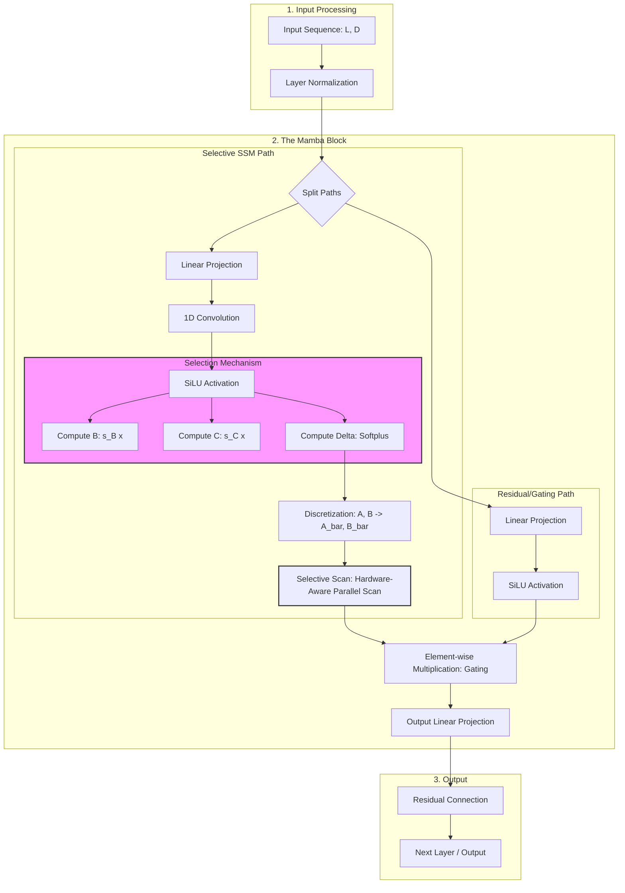

The **Mamba framework** is a new AI architecture for sequence modeling, introduced in late 2023 by Albert Gu and Tri Dao. It’s a **Selective State Space Model (SSSM)** designed to overcome the limitations of Transformers by offering **linear-time complexity**, better efficiency, and scalability for long sequences.

---

# 🐍 Mamba Framework 

## 🔑 Core Concept
- **Type:** Selective State Space Model (SSSM).  
- **Goal:** Efficient sequence modeling without relying on self-attention.  
- **Key Feature:** Input-dependent parameters that allow **content-aware computation**.  
- **Efficiency:** Achieves **linear-time throughput** compared to the quadratic cost of Transformers.

---

## 🚀 Motivation
- **Problem with Transformers:**  
  - Self-attention has quadratic complexity with sequence length.  
  - KV-cache grows rapidly, overwhelming GPU memory.  
  - Models often lose track of global information.  
- **Mamba’s Solution:**  
  - Uses state-space modeling with **selective updates**.  
  - Scales better for **long contexts**.  
  - Optimized for GPU hardware (leveraging techniques like **FlashAttention**).

---

## 🧩 Architecture Highlights
- **State Space Models (SSM):** Represent sequences as evolving states over time.  
- **Selective Mechanism:** Chooses which parts of the sequence to update, reducing unnecessary computation.  
- **Hybrid Nature:** Bridges ideas from RNNs, CNNs, and Transformers.  
- **Training:** Compatible with modern deep learning pipelines.

---

## 📊 Advantages
- **Linear-time complexity:** Handles very long sequences efficiently.  
- **Memory efficiency:** Smaller GPU footprint compared to Transformers.  
- **Scalability:** Suitable for large language models and long-context tasks.  
- **Potential Impact:** Could rival Transformers as a dominant architecture in AI.

---

## ⚠️ Challenges
- **Early stage:** Still being tested; adoption is limited compared to Transformers.  
- **Interpretability:** Understanding selective state updates is complex.  
- **Benchmarking:** Needs more real-world benchmarks to prove superiority.

---

## 📌 Summary Table

| Aspect              | Transformers         | Mamba Framework |
|---------------------|----------------------|-----------------|
| Complexity          | Quadratic (O(n²))    | Linear (O(n))   |
| Memory Usage        | High (KV-cache)      | Lower, efficient |
| Context Handling    | Fixed-length chunks  | Long sequences |
| Core Mechanism      | Self-attention       | Selective state space |
| Stage               | Mature, widely used  | Emerging, experimental |

---

**In short:** Mamba is a **next-generation sequence model** aiming to be as influential as Transformers, with linear-time efficiency and strong potential for long-context tasks.

---

# 🐍 Mamba vs. Transformer Workflow

## 🔄 Transformer (Self-Attention)
1. **Input sequence** → tokens.  
2. **Attention mechanism** compares every token with every other token.  
   - Complexity: \(O(n^2)\).  
3. **Weighted sum** of all tokens → new representation.  
4. **Output sequence** → context-aware embeddings.  

👉 Strength: Very powerful at capturing relationships.  
👉 Weakness: Expensive for long sequences.

---

## 🐍 Mamba (Selective State Space Model)
1. **Input sequence** → tokens.  
2. **State space update**: Maintains a hidden state that evolves over time.  
3. **Selective mechanism**: Chooses which parts of the state to update based on input content.  
   - Complexity: \(O(n)\).  
4. **Output sequence** → efficient, long-context embeddings.  

👉 Strength: Linear-time, memory efficient, scalable.  
👉 Weakness: Still experimental, less mature than Transformers.

---

## 📊 Side-by-Side Comparison

| Step              | Transformer (Attention) | Mamba (State Space) |
|-------------------|--------------------------|----------------------|
| Input handling    | All tokens compared      | Sequential state updates |
| Complexity        | Quadratic \(O(n^2)\)     | Linear \(O(n)\) |
| Memory usage      | High (KV-cache)          | Lower |
| Context length    | Limited                  | Long sequences |
| Mechanism         | Attention weights        | Selective state updates |

---

👉 Imagine **Transformers** as a classroom where *every student talks to every other student at once*, while **Mamba** is more like a *teacher keeping track of the class state and updating only when needed*.  

- https://excalidraw.com/#json=hztVtrk2e2VqyPi0bxRw_,_g96a8QENWOASUOSOvk99g
---
### Why Mamba Happened: The Transformer Bottleneck

- **The Attention Problem**: Transformers use self-attention, meaning every token is compared to every other token in a sequence. As context length (tokens) grows, memory and processing requirements explode quadratically.

- **Context Fragmentation**: To avoid out-of-memory errors, long documents must be split into chunks, resulting in the model losing continuity across the entire sequence.

- **KV Cache**: At inference, Transformers must store previously generated tokens (the KV cache), which rapidly consumes VRAM.

### What is Mamba?

- **Linear Complexity**: Mamba processes data step-by-step and updates its internal memory (hidden state) with each new token, scaling linearly rather than quadratically.

- **Selective Context**: Unlike older SSMs that treated all information equally, Mamba uses hardware-aware parallel algorithms and selective mechanisms to filter out noise, actively choosing which tokens to remember or forget.

- **No KV Cache**: It requires constant memory during inference, allowing for faster processing and ultra-long context handling (like analyzing whole genomes, hours of video, or entire novels).
