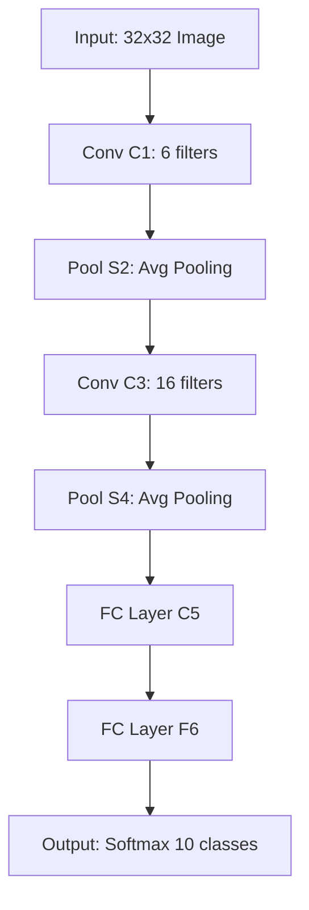

## 📘 LeNet Architecture (1998, Yann LeCun)

### 🔹 Key Features
- Designed for **handwritten digit recognition** (MNIST dataset).  
- One of the first successful CNNs, pioneering deep learning in computer vision.  
- Uses convolution + pooling layers followed by fully connected layers.  

---

### 🔹 Structure
1. **Input Layer**  
   - Grayscale image (e.g., 32×32 pixels).  

2. **Convolutional Layer (C1)**  
   - 6 filters of size 5×5.  
   - Produces 6 feature maps.  

3. **Pooling Layer (S2)**  
   - Average pooling (subsampling).  
   - Reduces spatial dimensions.  

4. **Convolutional Layer (C3)**  
   - 16 filters of size 5×5.  
   - Produces 16 feature maps.  

5. **Pooling Layer (S4)**  
   - Average pooling again.  

6. **Fully Connected Layers (C5, F6)**  
   - Dense layers for classification.  

7. **Output Layer**  
   - Softmax classifier (e.g., 10 classes for digits 0–9).  

---

### 🔹 Characteristics
- **Activation Function:** Sigmoid or tanh (ReLU wasn’t popular yet).  
- **Pooling:** Average pooling (modern CNNs use max pooling).  
- **Parameters:** Much fewer compared to modern CNNs.  
- **Strength:** Showed CNNs could outperform traditional methods in vision tasks.  

---

### 🔹 Applications
- Handwritten digit recognition (MNIST).  
- Early document recognition systems.  
- Foundation for modern CNNs like AlexNet, VGG, ResNet.  

---

✅ **In short:** LeNet is the pioneering CNN that introduced convolution + pooling + fully connected layers for image recognition, laying the groundwork for modern deep learning in computer vision.

---

Since image generation isn’t available right now, let me sketch out the **LeNet architecture flow in text form** so you can visualize it clearly:

---

✅ **This flow shows:**  
- Input image → convolution → pooling → deeper convolution → pooling → fully connected layers → output.  
- It’s the classic CNN pipeline that inspired modern architectures like AlexNet, VGG, and ResNet.  
