```mermaid
graph TD
    %% Root
    DL[Deep Learning Models]

    %% Main Branches
    DL --> Supervised[Supervised/Discrim]
    DL --> Unsupervised[Unsupervised/Rep]
    DL --> Generative[Generative Models]
    DL --> Specialized[Specialized & Hybrid]

    %% Supervised/Discriminative
    Supervised --> CNN[Convolutional - CNN]
    Supervised --> RNN[Recurrent - RNN]
    Supervised --> MLP[Multi-Layer Perceptron]

    CNN --> VGG[VGGNet]
    CNN --> ResNet[ResNet/Skip Conn]
    CNN --> Inception[Inception/GoogLeNet]
    CNN --> EfficientNet[EfficientNet]
    CNN --> YOLO[YOLO - Detection]
    CNN --> UNet[U-Net - Segmen]

    RNN --> LSTM[LSTM - Long Memory]
    RNN --> GRU[Gated Recurrent Unit]
    RNN --> BRNN[Bi-Directional RNN]

    %% Unsupervised/Representation
    Unsupervised --> AE[Autoencoders - AE]
    Unsupervised --> SOM[Self-Org Maps]
    Unsupervised --> DBN[Deep Belief Networks]

    AE --> VAE[Variational AE]
    AE --> DAE[Denoising AE]
    AE --> SAE[Sparse AE]

    %% Generative
    Generative --> GAN[Adv. Networks - GAN]
    Generative --> Diffusion[Diffusion Models]
    Generative --> Transformer[Transformers]

    GAN --> DCGAN[Deep Conv GAN]
    GAN --> CycleGAN[Style Transfer]
    GAN --> StyleGAN[High-Res Faces]

    Diffusion --> StableDiff[Stable Diffusion]
    Diffusion --> DALL-E[DALL-E]

    Transformer --> Encoder[BERT - Encoder only]
    Transformer --> Decoder[GPT - Decoder only]
    Transformer --> T5[T5 - Enc-Dec]
    Transformer --> ViT[Vision Transformers]

    %% Specialized
    Specialized --> RL[Deep Reinforcement]
    Specialized --> GNN[Graph Neural Nets]
    Specialized --> SNN[Spiking Neural Nets]

    RL --> DQN[Deep Q-Networks]
    RL --> PPO[Prox. Policy Opt]
    
    GNN --> GCN[Graph Conv Nets]
    GNN --> GAT[Graph Atten Nets]
```

# 🧠 Neural Network Family Tree (Complete)

## Artificial Neural Networks (ANN)
- Broad category of brain-inspired computational models.

---

### 1. Feedforward Neural Networks (FNN)
- Data flows in one direction, no cycles.
  - **Multilayer Perceptron (MLP)** — Vanilla network
  - **Radial Basis Function Networks (RBFN)**
  - **Extreme Learning Machines (ELM)**

---

### 2. Convolutional Neural Networks (CNN)
- Specialized for spatial data (images).
  - **LeNet**
  - **AlexNet**
  - **VGGNet**
  - **ResNet**
  - **EfficientNet**
  - **Capsule Networks (CapsNet)**

---

### 3. Recurrent Neural Networks (RNN)
- Designed for sequential/temporal data.
  - **Vanilla RNN**
  - **LSTM (Long Short-Term Memory)**
  - **GRU (Gated Recurrent Unit)**
  - **Bidirectional RNN**
  - **Echo State Networks (ESN)** / Reservoir Computing

---

### 4. Graph Neural Networks (GNN)
- Operate directly on graph structures.
  - **GCN (Graph Convolutional Network)**
  - **Graph Attention Network (GAT)**
  - **GraphSAGE**
  - **Message Passing Neural Networks (MPNN)**

---

### 5. Autoencoders
- Unsupervised learning; dimensionality reduction & feature learning.
  - **Vanilla Autoencoder**
  - **Variational Autoencoder (VAE)**
  - **Denoising Autoencoder**
  - **Sparse Autoencoder**
  - **Contractive Autoencoder**

---

### 6. Boltzmann Machines
- Stochastic recurrent networks.
  - **Restricted Boltzmann Machine (RBM)**
  - Basis for **Deep Belief Networks (DBN)**

---

### 7. Deep Belief Networks (DBN)
- Stack of RBMs trained layer by layer.

---

### 8. Self-Organizing Maps (SOM)
- Unsupervised learning; dimensionality reduction.

---

### 9. Generative Adversarial Networks (GAN)
- Two networks (generator + discriminator) compete to generate realistic data.
  - **Vanilla GAN**
  - **Conditional GAN**
  - **CycleGAN**
  - **StyleGAN**

---

### 10. Transformers
- Attention-based architecture for NLP and vision.
  - **BERT**
  - **GPT family**
  - **Vision Transformer (ViT)**
  - **T5**
  - **XLNet**

---

### 11. Probabilistic Models
- **Markov Chains** — probabilistic sequence models
- **Hidden Markov Models (HMMs)** — widely used in speech recognition, bioinformatics
- **Bayesian Neural Networks (BNN)** — uncertainty-aware models

---

### 12. Memory-Augmented / Meta-Learning Networks
- Combine neural nets with external memory or meta-learning.
  - **Neural Turing Machines (NTM)**
  - **Differentiable Neural Computers (DNC)**
  - **Meta-Attention Networks (MAN)**

---

### 13. Spiking Neural Networks (SNN)
- Biologically inspired, event-driven models.

---

### 14. Other Emerging Architectures
- **Liquid Neural Networks** — adaptive, dynamic models for time-varying data.
- **Reinforcement Learning Architectures** — policy networks, value networks.
- **Hybrid Models** — combining symbolic AI with neural nets.

---

## ✅ Summary
- **ANN** is the umbrella.  
- **MLP (vanilla network)** is the simplest feedforward type.  
- The tree expands into CNNs, RNNs, GNNs, Autoencoders, Boltzmann/DBN, SOM, GANs, Transformers, probabilistic models, memory-augmented networks, spiking networks, and emerging designs.  
- With this, you now have the **full landscape of neural network families** — classical, modern, and cutting-edge.

---

