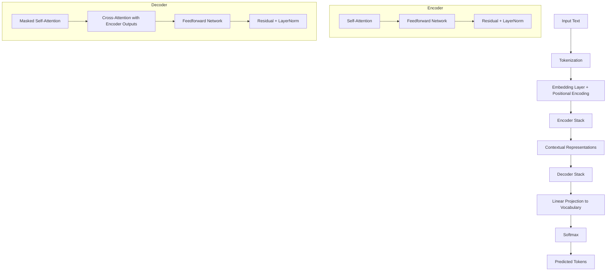

# Transformer Architecture & Large Language Models (LLMs)

## 📌 Context Window
- The **context window** defines how many tokens a model can consider at once when generating predictions.
- Larger context windows allow LLMs to handle longer documents, conversations, or dependencies.

---

## 🎯 Pre-training Objectives
- **Masked Language Modelling (MLM):**  
  In a sentence, some words are masked, and the model predicts the missing words.
- **Autoregressive Language Modelling (ALM):**  
  The model generates the next word in a sequence based on previous words.

---

## 🔧 Fine-tuning
- Fine-tuning takes a **pre-trained model** and further trains it on a **smaller or task-specific dataset**.  
- This adapts the general knowledge of the model to specialized tasks (e.g., sentiment analysis, summarization).

---

## ⚠️ Common Challenges Associated with LLMs
- **Computational resources:** Training and inference require massive hardware and energy.  
- **Biases and fairness:** Models may inherit biases from flawed or imbalanced training data.  
- **Interpretability:** Understanding and explaining LLM decisions is difficult due to their complex, opaque nature.  
- **Data privacy and cost:** Collecting and processing large datasets raises privacy concerns and financial costs.

---

## 🧩 Handling Out-of-Vocabulary (OOV) Words
- LLMs use **subword tokenization** techniques such as:
  - **Byte Pair Encoding (BPE)**
  - **WordPiece**
- These break unknown words into smaller, known subword units that the model can process.

---

## 🔎 Embedding Layers
- **Definition:** Convert categorical data (like words) into dense vector representations.  
- **Importance:**
  - **Dimensionality reduction** → reduces sparse high-dimensional data into manageable vectors.  
  - **Semantic understanding** → captures meaning and relationships between words.  
  - **Transfer learning** → pre-trained embeddings can be reused across models and tasks.

---

## 🎯 Attention Mechanism
- Allows LLMs to **focus on different parts of the input sequence** when making predictions.  
- **Self-attention:**  
  - Calculates attention scores for each token relative to all others.  
  - Captures dependencies regardless of distance.  
- This is the core innovation behind Transformers.


---

## Tokenization 
- converts raw text into smaller units called tokens, which can be words, subwords, or characters.
- The role of tokenization in LLM processing is vital as it transforms text into a format that the model can understand and process. 

---

## 📊 Measuring LLM Performance
- **Perplexity:** Evaluates how well the model predicts a sample (lower is better).  
- **Accuracy:** Proportion of correct predictions (used in classification tasks).  
- **F1 Score:** Harmonic mean of precision and recall (used in NER, classification).  
- **BLEU Score:** Compares machine-generated text to reference translations (used in machine translation).  
- **ROUGE Score:** Measures overlap between generated text and reference text (used in summarization).  

---

## 🧮 Coherence
- **Definition:** The ability of an AI model to produce output that is logical, consistent, and flows smoothly.  
- Often linked to **cumulative probability** in sampling, ensuring outputs make sense to humans.

---

## 🎛 Techniques for Controlling LLM Output
- **Temperature:** Controls randomness.  
  - Low → deterministic  
  - High → diverse  
- **Top-K Sampling:** Restricts choices to the top K probable tokens.  
- **Top-P (Nucleus) Sampling:** Chooses tokens from the smallest set whose cumulative probability exceeds threshold P.  
- **Prompt Engineering:** Crafting prompts to guide the model’s behavior.  
- **Control Tokens:** Special tokens to enforce style, format, or content type.

---

## ⚙️ AI Inference
- The phase where a **pre-trained model** applies learned knowledge to **new, unseen data**.  
- Examples: recognizing a stop sign, detecting spam, classifying sentiment.

---

## 💻 Approaches to reduce the computational cost of LLMs?
- **Model pruning:** Remove less important weights/neurons to reduce size.  
- **Quantization:** **Convert weights from 32-bit floats to lower precision (e.g., 8-bit integers).**  
- **Distillation:** **Train a smaller “student” model to mimic a larger “teacher” model.**  
- **Sparse attention:** **Limit attention to subsets of tokens to reduce load.**  
- **Efficient architectures:** Use designs like **Reformer** or **Longformer** to minimize computation while maintaining performance.
  - **Reformer** is a Transformer variant designed to be *more memory- and computation-efficient* by using techniques like **locality-sensitive hashing (LSH) attention** and **reversible layers**.  
  - **Longformer** is a Transformer variant designed to handle *very long sequences* efficiently by using **sparse attention patterns** that scale linearly instead of quadratically.  

**Reformer (2020, Google Research):**  
- A re-engineered Transformer architecture focused on efficiency.  
- Uses **LSH attention** to approximate full attention, reducing complexity from quadratic to logarithmic.  
- Employs **reversible residual layers**, which save memory by allowing activations to be recomputed instead of stored.  
- Goal: make training large models feasible on limited hardware.

**Longformer (2020, Allen Institute for AI):**  
- A Transformer variant optimized for **long documents**.  
- Standard Transformers scale poorly with sequence length (quadratic cost).  
- Longformer introduces **sparse attention** (local + global patterns) that scales **linearly** with sequence length.  
- Enables processing of thousands of tokens, useful for tasks like summarizing books, analyzing legal contracts, or genomic data.

---

### 🔎 Key Difference
- **Reformer** → Efficiency in memory and computation (better for training very large models).  
- **Longformer** → Efficiency in handling long sequences (better for tasks with huge text inputs).  


---
---
.  
### Transformer architecture flow diagram (ASCII)

```text
+---------------------------------------------------------------------------------------------+
|                                     Transformer (Encoder-Decoder)                           |
+---------------------------------------------------------------------------------------------+

Input text ──► Tokenization ──► Embeddings + Positional Encoding ──► Encoder Stack ──┐
                                                                                     │
                                                                                     │
                                                                                     ▼
                                                                   +-----------------------------+
                                                                   |         Encoder Block       |
                                                                   |  (repeated N times)         |
                                                                   +-----------------------------+
                                                                   |  Multi-Head Self-Attention  |
                                                                   |    ┌─────────┐  ┌─────────┐ |
                                                                   |    │  Q proj │  │  K proj │ |
                                                                   |    └─────────┘  └─────────┘ |
                                                                   |    ┌─────────┐              |
                                                                   |    │  V proj │              |
                                                                   |    └─────────┘              |
                                                                   |      Scaled Dot-Product     |
                                                                   |      Attention + Softmax    |
                                                                   |      Heads concat + linear  |
                                                                   |      Residual + LayerNorm   |
                                                                   |                             |
                                                                   |  Position-wise Feedforward  |
                                                                   |      (2 linear layers +     |
                                                                   |       activation, e.g., GELU)|
                                                                   |      Residual + LayerNorm   |
                                                                   +-----------------------------+

                                                                                     │
                                                                                     │ (encoder outputs: contextual representations)
                                                                                     ▼

Target prefix ─► Tokenization ─► Embeddings + Positional Encoding ─► Decoder Stack ─► Output logits ─► Softmax ─► Next-token

                                  +-----------------------------+
                                  |         Decoder Block       |
                                  |      (repeated M times)     |
                                  +-----------------------------+
                                  |  Masked Multi-Head          |
                                  |  Self-Attention (causal mask)|
                                  |   Residual + LayerNorm      |
                                  |                             |
                                  |  Cross-Attention to Encoder |
                                  |   (Q from decoder, K/V from |
                                  |    encoder outputs)         |
                                  |   Residual + LayerNorm      |
                                  |                             |
                                  |  Position-wise Feedforward  |
                                  |   Residual + LayerNorm      |
                                  +-----------------------------+

Training objectives:
- MLM (encoder-only, e.g., BERT): mask tokens in input; predict masked tokens.
- ALM (decoder-only or encoder-decoder, e.g., GPT/T5): predict next token autoregressively.

Sampling controls at inference:
- Temperature, Top-K, Top-P (nucleus), prompts/control tokens.

Notes:
- Embedding layer maps tokens to dense vectors; positional encoding injects order.
- Multi-head attention: multiple parallel attention heads capture diverse relations.
- Residual connections and LayerNorm stabilize training and improve gradient flow.
- Output projection (linear) maps decoder hidden states to vocabulary logits.
```

---

### Decoder-only transformer (GPT-style) variant

```text
Input tokens ─► Embeddings + Positional Encoding ─► [Masked Self-Attn + FFN] × L ─► Linear ─► Softmax

Where each block:
- Masked Multi-Head Self-Attention (causal mask prevents looking ahead)
- Residual + LayerNorm
- Position-wise Feedforward
- Residual + LayerNorm
```

---

### Encoder-only transformer (BERT-style) variant

```text
Input tokens ─► Embeddings + Positional Encoding ─► [Self-Attn + FFN] × L ─► Task head
                                                   (no causal mask; bidirectional context)

Common task heads:
- Classification: [CLS] vector → linear layer
- Token-level tagging: per-token linear layer
- MLM pretraining: predict masked tokens via vocabulary projection
```

---

### Attention shapes cheat sheet

```text
Given batch B, sequence length T, hidden size d_model, heads H, head dim d_k:

Embeddings:        (B, T, d_model)
Q/K/V projections: (B, T, H, d_k)
Attention scores:  (B, H, T, T)  → softmax over last dimension
Head outputs:      (B, T, H, d_k) → concat → (B, T, d_model) → linear
```

---

## 🔎 Scaled Dot-Product Attention (Math)

The attention mechanism computes:

$$
\text{Attention}(Q, K, V) = \text{softmax}\left(\frac{QK^T}{\sqrt{d_k}}\right)V
$$

- $Q$ = Queries  
- $K$ = Keys  
- $V$ = Values  
- $d_k$ = dimension of keys (used for scaling)  

This ensures stable gradients and prevents overly large dot products.

---

## 🖼️ Transformer Flow (Mermaid Diagram)



---

### 🧩 Key Takeaways
- **Encoder**: Builds contextual representations using self-attention.  
- **Decoder**: Uses masked self-attention (causal) + cross-attention to encoder outputs.  
- **Output**: Vocabulary logits → softmax → next token prediction.  

---
