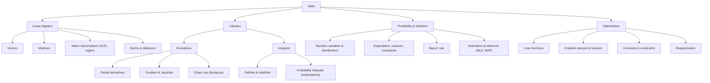

# 📘 Mathematics for AI/ML Cheatsheet

## 🧠 Core Areas

- **Linear Algebra** - Math of vectors and matrices, used to **solve systems and transformations.**
  - **Vector (1D)** → list of numbers \([x_1, x_2, …, x_n]\)  
  - **Matrix (2D)** → grid of numbers (rows × columns)  
  - **Tensor (nD)** → generalization (2D = matrix, 3D = cube, higher‑D for deep nets)  
  - **Dot Product (1D·1D)** → similarity measure  
  - **Matrix Multiplication (2D×2D)** → combine transformations / weights  
  - **Eigenvalues** → numbers that tell you *how much variance* (or importance) is captured in a particular direction.  
  - **Eigenvectors** → the *directions* themselves in which that variance lies.  
    👉 In **PCA (Principal Component Analysis)**:  
    - **Eigenvectors** = principal components (new axes) **Eigenvalues** = amount of data variance (Spread) explained along each axis.
    - So: **Eigenvectors = directions, Eigenvalues = strength of those directions.**
    - 
  - **Applications** → data representation, embeddings, NN weights  

- **Calculus** - Study of change, with derivatives (rates) and integrals (areas/accumulation).
  - **Derivative (1D)** → slope of function
    - Differentiation: solving derivatives (rate of change).
      - Applications: **Physics** → velocity, acceleration. **Engineering** → max strength, efficiency. **(ML/DL)** → gradient descent for optimization.    
  - 
  - **Gradient (nD)** → vector of **partial derivatives** ( PD - measure how a multivariable function changes when only one of its input variables changes).  
  - **Chain Rule** → backpropagation in neural nets  
  - **Integral (area under curve)** → probability distributions
    - Integration: solving integrals (area/accumulation).
      - Applications: **Probability** → expectation values. **ML** → ROC(Receiver operating charateristics)-AUC, continuous loss functions. **Physics** → displacement from velocity.   
  - 
  - **Applications** → optimization, training deep nets  

- **Probability** (Math of uncertainty, measuring likelihood of events.) & **Statistics** (Collecting, analyzing, and **interpreting data** to find patterns and make decisions.)  
  - **Random Variable (1D)** → maps outcomes to numbers  
  - **Distribution (1D/2D)** → Normal, Bernoulli, Binomial, etc.
  - 
  - **Expectation (mean)** → average outcome  
  - **Variance (spread)** → measure of dispersion  
  - **Covariance (2D)** → relationship between variables  
  - **Bayes’ Theorem** → conditional probability  
  - **Applications** → uncertainty, generative models, evaluation  

- **Optimization**  
  - **Gradient Descent (iterative)** → update parameters step by step  
  - **Stochastic Gradient Descent (SGD)** → mini‑batch updates  
  - **Convex Functions** → global minima easier to find  
  - **Lagrange Multipliers** → constrained optimization  
  - **Applications** → training ML/DL models  

- **Discrete Mathematics** -  Study of countable structures (graphs, logic, combinatorics, algorithms). 
  - **Logic (Boolean)** → true/false operations  
  - **Sets (1D)** → collections of elements  
  - **Functions (mapping)** → input → output  
  - **Graph Theory (nodes+edges)** → Graph Neural Networks  
  - **Combinatorics (counting)** → feature selection, probability spaces  

- **Information Theory** - Quantifies information, communication, and entropy in data and signals.  
  - **Entropy (uncertainty measure)**  
  - **Cross‑Entropy (loss function)**  
  - **KL Divergence (distribution difference)**  
  - **Applications** → loss functions, uncertainty quantification  

---

## 📐 Key Formulas
- **Gradient Descent Update**:  

$$
\theta \leftarrow \theta - \alpha \cdot \nabla J(\theta)
$$

- **Bayes’ Theorem**:  

$$
P(A|B) = \frac{P(B|A) \cdot P(A)}{P(B)}
$$

- **Dot Product**:

$$
\mathbf{a} \cdot \mathbf{b} = \sum_i a_i b_i
$$

- **Cross‑Entropy Loss**:  

$$
L = -\sum y \log(\hat{y})
$$

---

## 🚀 Applications in AI/ML
- **Linear Algebra** → embeddings, transformations, NN weights  
- **Calculus** → backpropagation, optimization  
- **Probability** → Bayesian inference, generative AI  
- **Optimization** → training deep learning models  
- **Discrete Math** → graph neural networks, combinatorial spaces  
- **Information Theory** → loss functions, model evaluation  

---

# ⚡ Pocket Version (super short)
- **Linear Algebra** → Vector (1D), Matrix (2D), Tensor (nD), dot product, eigenvalues  
- **Calculus** → Derivative (1D), Gradient (nD), Chain rule, Integral  
- **Probability** → Random variable, Distribution, Expectation, Variance, Bayes  
- **Optimization** → Gradient descent, Convexity, Lagrange multipliers  
- **Discrete Math** → Logic, Sets, Graphs, Combinatorics  
- **Info Theory** → Entropy, Cross‑Entropy, KL divergence  
